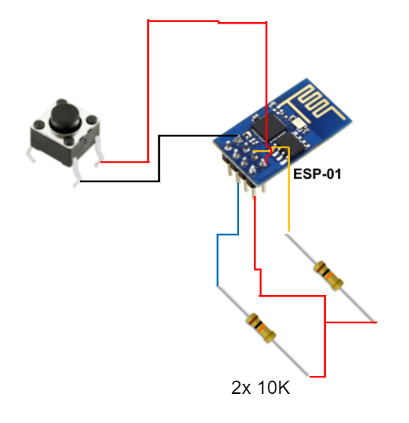

# Aloioff

## Introdução

Aloioff é um dispositivo de acionamento de cargas pela rede, compatível com Alexa, Google Home e Smarthphones.

Clone do Sonoff, mas com a vantagem do ESP8266 ser removível e reprogramável, ou seja, é um kit de desenvolvimento IoT!

## Preparação do Ambiente

- Primeiro você precisará fazer o download da IDE do Arduino:
  - https://www.arduino.cc/en/software
- Depois da IDE do Arduino ser instalada, siga o tutorial abaixo para configurar o pacote do ESP8266:
  - https://www.filipeflop.com/blog/programar-nodemcu-com-ide-arduino/
- Depois de tudo configurado, selecione a board `Generic ESP8266 Module` no menu `Tools` da IDE do Arduino.
- Para finalizar, precisaremos de um plugin chamado `ESP8266 LittleFS Data Upload`.
  - https://github.com/earlephilhower/arduino-esp8266littlefs-plugin

Pronto! O ambiente necessário foi instalado!

## Compilação e Publicação

- Primeiro conecte o ESP8266 na porta USB através do programador USB:
  - https://www.filipeflop.com/produto/adaptador-usb-para-modulo-wifi-esp8266-esp-01
- Selecione o menu `Tools`, em seguida `Board` e selecione a placa `Generic ESP8266 Module`.
- Selecione a porta USB correta no menu `Tools` e efetue o upload do código no ESP8266.
- Selecionar o menu `Tools` e depois `Flash Size` e escolher a opção `1M FS:144Kb`.
- Terminado o upload você precisará subir os arquivos da pasta `data`, para isso acesse o menu `Tools` novamente e clique no plugin `ESP8266 LittleFS Data Upload`.

Pronto! O código e os dados estão publicados no ESP8266!

## Como utilizar

- Pressione o botão do Aloioff por 5 a 10 segundos para ele entrar em modo de fábrica.
- Utilize seu smartphone para conectar na rede `ALOITECH` que o ESP8266 criará no modo de fábrica.
  - A senha é `12345678`
- Feito isso, utilize o navegador de internet do seu smartphone para acessar o endereço `http://10.0.0.1`
- Configure o nome do dispositivo e os dados de acesso do seu WiFi.
- Clique no menu `Reiniciar` e depois no botão `Reiniciar` para confirmar a ação.

Pronto! Seu Aloioff está configurado e funcionando!

## Registrando na Alexa

- Você só precisa registrar o seu novo dipositivo na Alexa, através do aplicativo da Alexa, conforme esse tutorial:
  - http://blog.arduinoomega.com/automacao-residencial-com-esp8266-e-alexa/
  - Avance até o tópico `Conexão pelo aplicativo Alexa` para aprender como configurar o Aloioff no aplicativo da Alexa.

## Esquema elétrico

O esquema elétrico do Aloioff é bem simples e é ligado em série com a carga, mas é possível também fazer o acionamento em paralelo com um interruptor.

## Hack necessário para funcionar

Infelizmente os módulos de relê chineses tem um problema crônico em que o ESP01 não inicia sozinho, por causa de um projeto malfeito pelos chineses.

Para contornarmos esse problema, precisamos de um `hack`, ou seja um ajuste técnico, que são dois resistores de 10K conectados no pino `3V3` e nos pinos `EN` e `GPIO0`.

E não esqueça de ligar o botão também conforme mostra o esquema abaixo:

## Projeto da Caixa

- Na pasta `case` você encontrará os arquivos fonte `*.scad`, tanto da caixa quanto da tampa.
- Para editar os arquivos `*.scad` utilize o editor open source chamado `openSCAD`.
- Se quiser imprimir diretamente, utilize os arquivos `*.stl` que já estão prontos para imprimir.
- Utilize a configuração `Draft - 0.2mm` para imprimir.
